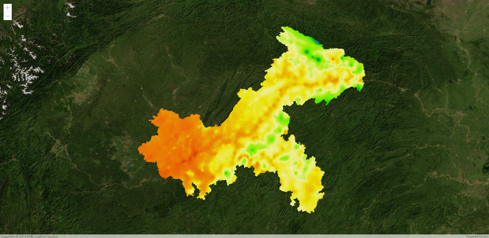

# test-arcgis-add-image

#### arcgis js api 叠加图片

通过扩展 BaseDynamicLayer.createSubclass() 类自定义CustomImageOverlayLayer图层

### 示例
代码：[输入链接说明](https://gitee.com/angiser-demo/arcgis-demo/edit/master/test-arcgis-add-image/index.html)

